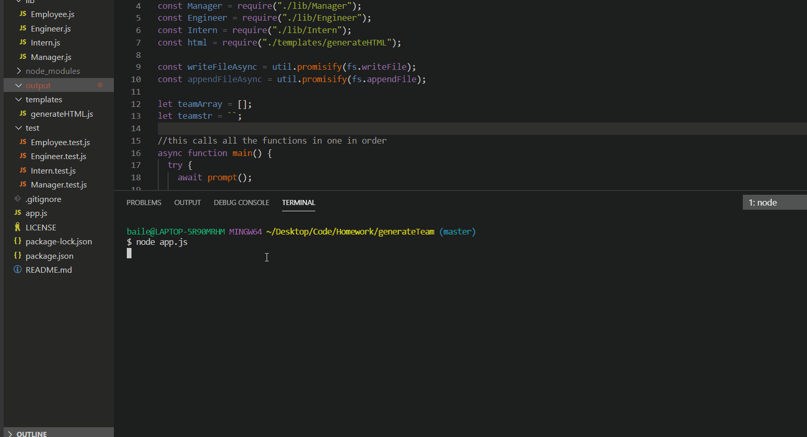

This repository ("teamGenerator") is where I (Joe Bailey) developed my first node.js application using JavaScript for the University of Richmond boot camp that I am currently enrolled in. The goal for this homework was to become more familiar with Node.js by demonstrating the ability to create a professional template for team creation. This application had the most indepth directions to date and required multiple different files working cohesively.

<h3>Installation</h3>

We live in an age where agile project management is common with many enterprise companies. Having this app create your team for you is very beneficial to having a stream lined project.

<h3>User Story</he>
As a manager
I want to generate a webpage that displays my team's basic info
so that I have quick access to emails and GitHub profiles

<h4>Credits</h4>

I was the main creator of the main application and repository. For help when facing obstacles I leaned on my friend Blake, and my friend Chris. Blake is a programmer with 7+ years in the business, and Chris is a work friend who is a fantastic problem solver. I also used YouTube to find different videos on JavaScript, generating HTML, and various troubleshooting tips.

<h4>Functionality</h4>

A GIF has been supplied to see the application in action. The user is prompted for different information such as office number, school name, and github username based on job qualifications. At the end of the application a HTML file is generated and able to be viewed in the browser. 

